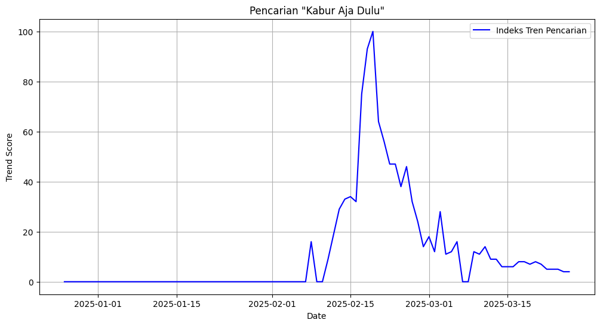
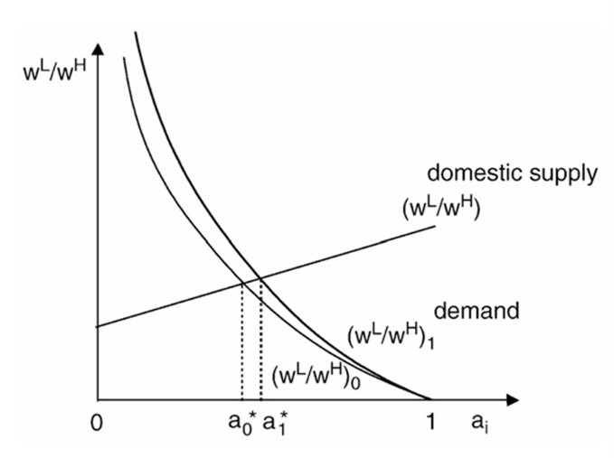
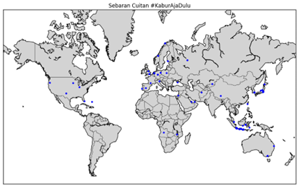

# Fenomena #KaburAjaDulu: Perspektif Ekonomi  Politik Klasik dan Ketenagakerjaan
Ekonomi Politik [B10B.6201]
Tugas esai singkat dan "crawling" 
120610210018 

## 1 Latar Belakang
Tagar KaburAjaDulu belakangan ini sedang ramai di yang mendorong generasi  muda Indonesia untuk mencari kehidupan yang lebih baik di luar negeri. Fenomena  emigrasi tenaga kerja atau khususnya tenaga kerja terampil dikenal sebagai brain drain merupakan fenomena yang belakangan ini ramai diperbincangkan kembali di beberapa  sosial media, salah satunya di platform media sosial X (sebelumnya Twitter).  Fenomena tren ini mendorong generasi muda Indonesia untuk mencari kehidupan yang  lebih baik di luar negeri. Tagar ini mencerminkan ketidakpuasan terhadap kondisi  ekonomi domestik, termasuk rendahnya upah minimum, sulitnya akses terhadap  pekerjaan berkualitas, serta minimnya kesempatan untuk berkembang secara  profesional. 

Hal ini menjadi isu penting di Indonesia dalam beberapa tahun terakhir. Fenomena  ini merujuk pada hilangnya sumber daya manusia yang memiliki keterampilan dan  pendidikan tinggi karena mereka memilih bekerja atau menetap di luar negeri. Studi di  Argentina menunjukkan bahwa total kehilangan tenaga profesional dan teknisi ke  negara tersebut melalui emigrasi permanen mencapai empat ribu orang dalam kurun  waktu sepuluh tahun. Angka ini mewakili sekitar 8 persen dari total output lulusan  universitas-universitas di Argentina selama satu dekade (Horowitz, 1962).

Menurut data dari Direktorat Jenderal Imigrasi, antara tahun 2019 hingga 2023,  sekitar 3.912 Warga Negara Indonesia (WNI) berpindah kewarganegaraan menjadi 
warga negara Singapura, dengan mayoritas berasal dari kelompok usia produktif 25– 35 tahun (Direktorat Jenderal Imigrasi, 2023). Selain itu, data dari KPU juga  menyebutkan bahwa banyak Warga Negara Indonesia (WNI) yang memilih bekerja di  negara-negara seperti Malaysia, Amerika Serikat, dan beberapa negara-negara di Eropa (KPU, 2024).

Emigrasi profesional merupakan respons spesifik yang tersedia bagi sekelompok  kecil orang yang memiliki pelatihan dan bakat tinggi terhadap situasi asimetri secara  umum dalam hubungan antar negara. Hal ini pada akhirnya membuat sudut pandang  baru yang menyebutkan bahwa emigrasi merupakan padanan manusia dan cerminan  dari pengaturan internasional di mana ekonomi yang lebih lemah berada di bawah  kepentingan dan prioritas ekonomi yang lebih kuat. 

Menurut Oteiza (1969), faktor utama yang mendorong tenaga kerja terampil untuk  meninggalkan negaranya:

1. Perbedaan pendapatan atau ekonomi antara jumlah dan keamanan remunerasi  untuk tenaga kerja profesional di negara-negara maju dan di negara-negara  yang kurang berkembang. 

2. Perbedaan dukungan logistik antara peralatan, staf, dana, dan fasilitas umum  untuk penelitian dan praktik di negara maju dan negara kurang berkembang.

3. Perbedaan prestise dalam status yang diberikan kepada para ilmuwan dan  profesional di antara kedua jenis masyarakat tersebut. 

4. Perbedaan residual yang mencakup isu-isu seperti ketidakstabilan politik dan  ancaman penindasan versus perdamaian sosial dan kebebasan politik relatif. 

Brain drain memiliki dampak yang signifikan terhadap ekonomi domestik,  terutama dalam hal produktivitas negara. Jika para tenaga kerja terbaik terus  meninggalkan Indonesia, maka pertumbuhan ekonomi nasional bisa terhambat, dan  inovasi dalam sektor industri maupun teknologi menjadi semakin sulit untuk  berkembang. Hal ini pada akhirnya menjadikan fenomena brain drain perlu ditelaah 
lebih lanjut terutama di Indonesia untuk mendapatkan pembahasan yang lengkap dalam  menjelaskan fenomena tersebut. 

## 2 Landasan Teori
Dalam pendekatan klasik, ekonomi politik mengacu pada sistem kepuasan  keinginan pribadi yang terdiri dari pelaku ekonomi yang independen. Selama periode  ekonomi politik klasik, ada beberapa istilah yang berbeda namun saling berkaitan yang  berbeda namun terkait digunakan untuk merujuk pada sistem kepuasan keinginan ini:  masyarakat sipil, ekonomi pasar, masyarakat borjuis, masyarakat borjuis, masyarakat,  kapitalisme, dan lain-lain. 

Mobilitas tenaga kerja dapat dianggap sebagai mekanisme alami dalam pasar  tenaga kerja. Tokoh-tokoh utama seperti Adam Smith dan David Ricardo menekankan  pentingnya mekanisme pasar bebas, di mana tenaga kerja akan berpindah ke lokasi  yang memberikan kompensasi terbaik dan peluang kerja yang lebih menguntungkan. 

Adam Smith dalam bukunya The Wealth of Nations berpendapat bahwa tenaga  kerja cenderung bergerak menuju sektor atau wilayah di mana mereka dapat  memperoleh manfaat ekonomi terbesar. Pada konteks brain drain, perpindahan tenaga  kerja terampil ke luar negeri mencerminkan ketidakseimbangan dalam pasar tenaga  kerja domestik, di mana upah dan peluang kerja tidak kompetitif dibandingkan dengan  yang ditawarkan oleh negara lain. 

Sementara itu, David Ricardo dalam teori keunggulan komparatifnya menjelaskan  bahwa negara sebaiknya mengkhususkan diri dalam produksi barang dan jasa yang  paling efisien. Jika Indonesia mengalami fenomena brain drain, maka negara  kehilangan sebagian tenaga kerja yang dapat meningkatkan efisiensi produksi dalam  sektor-sektor tertentu, sehingga daya saing global menjadi lebih lemah. 

Dari perspektif teori klasik, migrasi tenaga kerja juga dapat dilihat sebagai  mekanisme pasar yang memungkinkan individu mencari keuntungan ekonomi  maksimal. Namun, dalam jangka panjang, apabila eksodus tenaga kerja tidak  diimbangi dengan kebijakan yang mendorong retensi tenaga kerja berkualitas, sehingga negara akan mengalami kesulitan dalam mempertahankan pertumbuhan ekonomi yang  berkelanjutan. 

Temuan dari Portes (1976) dalam tulisannya yang berjudul “Determinants of the  Brain Drain” menyebutkan bahwa terdapat tiga penentu yang menyebabkan terjadinya  fenomena brain drain: 

1. Faktor Penentu Primer
a. Perbedaan pendapatan atau ekonomi antara jumlah dan keamanan  remunerasi untuk tenaga kerja profesional di negara-negara maju dan  di negara-negara yang kurang berkembang. 
b. Perbedaan dukungan logistik antara peralatan, staf, dana, dan fasilitas  umum untuk penelitian dan praktik di negara maju dan negara kurang  berkembang. 
c. Perbedaan prestise dalam status yang diberikan kepada para ilmuwan  dan profesional di antara kedua jenis masyarakat tersebut. 
d. Perbedaan residual yang mencakup isu-isu seperti ketidakstabilan  politik dan ancaman penindasan versus perdamaian sosial dan  kebebasan politik relatif. 

2. Faktor Penentu Sekunder 
a. Ketidakseimbangan Struktural 
Hal ini mengacu pada ketidaksesuaian yang mendasar dalam sistem,  khususnya antara pelatihan yang diberikan di sekolah-sekolah dengan  kebutuhan nyata dan mendesak dalam bidang kesehatan di suatu negara.

3. Faktor Penentu Tersier 
a. Perbedaan dalam prestasi akademik 
Emigran cenderung lebih unggul secara akademis, memiliki lebih  banyak penghargaan, dan telah menerbitkan lebih banyak karya ilmiah  dibandingkan non emigran. Hal ini menunjukkan adanya seleksi positif,  di mana emigran berasal dari kalangan yang lebih terampil. Akibatnya, 
negara asal merasakan dampak negatif berupa kehilangan tenaga kerja  berkualitas tinggi. 
b. Perbedaan dalam situasi kehidupan 
Professional yang berencana tinggal lebih cenderung memiliki anak  dibandingkan mereka yang ingin beremigrasi. Selain itu, ada  perbedaan pendapatan dan tingkat kepuasan terhadap penghasilan  antara kedua kelompok ini. Data tersebut memberikan wawasan  tentang faktor-faktor yang memengaruhi keputusan emigrasi di  kalangan dokter. 
c. Perbedaan dalam jaringan hubungan sosial yang relevan dengan  keputusan karier. 
Jaringan sosial yang mengenal profesional lainnya yang  berpengalaman menjadi salah satu penentu keputusan individu. Hal ini  pada akhirnya mendorong individu profesional untuk melakukan  emigrasi. 

## 3 Implikasi Pada Ilmu Ekonomi 
Analisis yang telah ditemukan sebelumnya oleh (Mountford & Rapoport, 2011) menunjukkan bahwa tren saat ini terhadap emigrasi yang didominasi oleh tenaga kerja terampil dari negara miskin ke negara kaya dalam jangka panjang dapat meningkatkan ketidakseimbangan dalam distribusi pendapatan dunia karena negara-negara yang relatif miskin tumbuh dalam jumlah besar dalam hal populasi. Namun, dalam jangka pendek, ketimpangan dunia dapat menurun karena peningkatan PDB per kapita di negara-negara berkembang yang besar dengan tingkat emigrasi terampil yang cukup rendah.

Kurva tersebut menunjukkan bahwa imigrasi pekerja terampil dapat mengurangi proporsi penduduk asli yang memiliki keinginan untuk menjadi pekerja terampil. Ketika tenaga kerja terampil dari luar masuk, pasokan pekerja terampil meningkat, sehingga rasio upah pekerja tidak terampil terhadap pekerja terampil (w^L/w^H) menurun. Penurunan ini mengurangi insentif bagi penduduk asli untuk berinvestasi dalam keterampilan karena premi upah untuk pekerjaan terampil menjadi lebih kecil. Akibatnya, lebih sedikit penduduk asli yang memilih menjadi pekerja terampil, yang dapat berdampak pada struktur tenaga kerja dan pertumbuhan ekonomi dalam jangka panjang. Dampak lain dalam lingkup negara penerima dari fenomena brain drain dapat terlampir sebagai berikut:

### 3.1 Ekonomi Negara Penerima
Ekonomi negara penerima pada konteks ini merujuk pada negara yang menerima imigran pekerja terampil. Jika efek dinamis lebih besar daripada efek statis, maka efek jangka panjang dari imigrasi permanen pekerja terampil akan meningkatkan tingkat akumulasi modal manusia, tingkat fertilitas yang lebih rendah dan peningkatan tingkat pertumbuhan di perekonomian penerima.

#### 3.1.1 Efek Statis
Imigrasi pekerja terampil dapat menurunkan upah keseimbangan pekerja terampil domestik. Efek statis mengurangi proporsi penduduk asli yang memilih untuk menjadi pekerja terampil dan hal ini ceteris paribus meningkatkan tingkat fertilitas.

#### 3.1.2 Efek Dinamis
Ekonomi penerima akan menyatu dengan tingkat pertumbuhan yang lebih tinggi dan stabil. Hal ini berdampak positif pada proporsi yang memilih untuk merekrut pekerja dengan keterampilan dan berdampak negatif pada tingkat fertilitas. Jika efek pertumbuhan cukup kuat, imigrasi permanen dengan keterampilan tinggi dapat meningkatkan tingkat sumber daya manusia dan mengurangi tingkat fertilitas di negara penerima.

### 3.2 Ekonomi Negara Pengirim
Ekonomi negara pengirim pada konteks ini merujuk pada negara asal dari pekerja terampil yang beremigrasi ke negara penerima. Hilangnya agen-agen terampil yang beremigrasi akan ceteris paribus akan menurunkan tingkat keterampilan (h). tetapi kemungkinan emigrasi juga akan meningkatkan insentif untuk mengakumulasi modal manusia. Pada bagian ini penelitian sebelumnya menunjukkan bahwa efek meningkatkan insentif lebih dominan daripada efek Hilangnya agen jika emigrasi dibatasi dan keuntungan upah dari emigrasi cukup tinggi.

#### 3.2.1 Pengurangan Kapital Manusia
Brain drain menyebabkan hilangnya tenaga kerja dengan keterampilan tinggi, yang pada akhirnya menurunkan kualitas sumber daya manusia dalam negeri. Tenaga kerja yang memiliki keahlian tinggi dan pendidikan yang baik adalah salah satu faktor utama dalam meningkatkan produktivitas dan daya saing ekonomi. Jika mereka terus berpindah ke luar negeri, maka negara akan mengalami kesulitan dalam mengembangkan sektor-sektor yang bergantung pada keahlian khusus, seperti teknologi, riset, dan industri kreatif.

### 3.3 Dampak terhadap Investasi dan Inovasi
Perusahaan yang bergerak dalam bidang teknologi tinggi dan penelitian sering kali membutuhkan tenaga kerja yang memiliki keterampilan dan pengalaman khusus. Jika tenaga kerja terampil lebih memilih bekerja di luar negeri, maka investasi dalam sektor ini bisa menurun karena perusahaan akan kesulitan mendapatkan tenaga kerja yang sesuai. Hal ini juga dapat menghambat inovasi di dalam negeri karena kurangnya tenaga ahli yang dapat mengembangkan teknologi dan produk baru.

### 3.4 Kesenjangan Ekonomi dan Ketimpangan Pendapatan
Brain drain juga dapat memperlebar kesenjangan ekonomi dalam negeri. Sebagian besar tenaga kerja yang bermigrasi ke luar negeri berasal dari kelas menengah ke atas yang memiliki akses lebih baik terhadap pendidikan dan pelatihan. Sementara itu, mereka yang tertinggal di dalam negeri mungkin mengalami kesulitan dalam memperoleh pekerjaan yang layak, sehingga meningkatkan ketimpangan pendapatan dan memperburuk masalah sosial.

## 4 Analisis
### 4.1 Sumber Data dan Metode
Platform media sosial X merupakan salah satu media sosial terbanyak digunakan oleh orang Indonesia dengan persentase penggunan sebanyak 50,3% (Simon, 2025). Pada penelitian ini, penulis menggunakan pengambilan data dengan menggunakan metode perayapan (crawling) dengan platform Tweet Harvest, penggunaan alat ini memungkinan penulis untuk mengetahui berbagai aspek yang terdapat dalam suatu cuitan secara bersamaan. 

Pada crawling data di X, penulis membatasi data yang termasuk pada observasi dengan persyaratan harus memenuhi minimal disukai oleh 10 akun, hal ini bertujuan untuk menyaring data agar hanya mencakup unggahan yang memiliki tingkat interaksi tinggi, sehingga lebih relevan untuk dianalisis. Selain itu karena limitasi dalam pengambilan data, penulis hanya mengambil 236 cuitan karena limitasi baru dari syarat ketentuan dan penggunaan platform X (Elon, 2023)

### 4.2 Statistik Deskriptif

Pada gambar 4.1 menunjukkan visualisasi cuitan dari #KaburAjaDulu yang tersebar dari  beberapa titik lokasi. Observasi yang ditemukan terdiri dari 97 pemosting di Indonesia, 75 observasi berada di luar Indonesia, dan 64 observasi tidak menyebutkan dengan jelas lokasi asalnya. Adapun berdasarkan urutan negara, Jepang merupakan negara kedua terbanyak dengan 16 cuitan setelah negara Indonesia dalam tagar ini, mengingat banyak diaspora Indonesia yang bekerja di negara Jepang.

#### 4.2.1 Enggagement
| **Metrik**   | **Observasi (Obs)** | **Rata-rata (Mean)** | **Standar Deviasi (Std. Dev)** | **Minimum (Min)** | **Maksimum (Max)** |
|--------------|---------------------|-----------------------|-------------------------------|-------------------|--------------------|
| **Suka**     | 236                 | 3.776,33             | 7.911,81                     | 18                | 47.541             |
| **Kutipan**  | 236                 | 93,27                | 272,50                       | 0                 | 2.743              |
| **Balasan**  | 236                 | 126,21               | 233,18                       | 9                 | 2.524              |
| **Retweet**  | 236                 | 784,27               | 1.741,24                     | 0                 | 13.551             |

Dataset yang berhasil diambil dengan metode crawling mencakup 236 cuitan terkait fenomena #KaburAjaDulu di media sosial X, dengan berbagai metrik interaksi seperti jumlah suka (favorites), kutipan (quotes), balasan (replies), dan retweet. Dari analisis statistik deskriptif, terlihat bahwa jumlah suka pada cuitan- cuitan ini memiliki rata-rata sekitar 3.776 dengan standar deviasi yang cukup tinggi, yaitu 7.911, menunjukkan adanya beberapa cuitan yang ramai dengan jumlah suka mencapai 47.541, sementara yang paling sedikit hanya memperoleh 18 suka pada observasi 236 cuitan. Jumlah kutipan pada cuitan juga sangat bervariasi, dengan nilai tertinggi 2.743, tetapi sebagian besar cuitan memiliki kutipan yang jauh lebih rendah, dengan nilai median hanya 13,5 retweet.

Dari sisi balasan, cuitan- cuitan dalam set data ini rata-rata menerima 126 balasan, tetapi terdapat beberapa unggahan yang memperoleh jumlah balasan yang sangat tinggi, hingga 2.524. Hal ini menunjukkan bahwa topik #KaburAjaDulu memicu banyak diskusi dan perdebatan di media sosial. Sementara itu, jumlah retweet pada cuitan dalam dataset ini memiliki nilai maksimum 13.551, dengan rata-rata sekitar 784 retweet. Namun, mayoritas cuitan memiliki retweet yang lebih sedikit, dengan nilai tengah sekitar 119,5, menunjukkan bahwa hanya sebagian kecil unggahan yang menjadi viral dalam skala besar.

Postingan dengan jumlah suka tertinggi dalam dataset ini berasal dari akun @intinyadeh, yang memperoleh 47.541 suka. Dalam unggahannya, pengguna ini membahas pernyataan Menteri Bahlil yang meragukan nasionalisme individu yang ingin bekerja atau pindah ke luar negeri dengan menggunakan tagar #KaburAjaDulu. Postingan tersebut juga menyoroti bagaimana diaspora Jepang di platform media sosial TikTok mengangkat isu bahwa bekerja di luar negeri sering kali bukan pilihan semata, melainkan akibat dari kegagalan negara dalam menjamin kesejahteraan warganya. Selain itu, unggahan ini juga menyinggung bagaimana video yang membahas fenomena ini telah mencapai 3 juta penayangan sebelum akhirnya dihapus oleh TikTok karena dianggap melanggar Panduan Komunitas, yang kemudian memicu spekulasi bahwa penghapusan tersebut merupakan bentuk pembungkaman terhadap diskusi mengenai topik ini.

## 5 Diskusi dan Kesimpulan
Berdasarkan data yang tersedia, Indonesia menghadapi fenomena dan tantangan terkait narasi untuk menghadapi fenomena brain drain. Indeks human flight and brain drain Indonesia mencapai 5,4 dari tahun 2007 hingga 2024 (Fund for Peace, 2024), angka indeks ini lebih tinggi dari rata-rata 175 negara yang berada di angka 4.98. Faktor utama yang mendorong migrasi ini antara lain:
1.	Meningkatnya tingkat pengangguran mencapai 4,91% pada Q3 tahun 2024. Kurangnya kesempatan kerja yang layak menjadikan lulusan pendidikan tinggi mencari peluang di luar negeri.
2.	Gaji yang tidak kompetitif. Banyak tenaga kerja terampil merasa bahwa gaji yang mereka dapatkan di Indonesia tidak sebanding dengan beban kerja dan keterampilan yang mereka miliki. Perbandingan upah tenaga kerja profesional di Indonesia dengan negara-negara maju menunjukkan kesenjangan yang cukup tinggi.
3.	Kurangnya investasi dalam penelitian dan pengembangan membuat banyak tenaga ahli di bidang sains dan teknologi memilih untuk bekerja di negara yang lebih mendukung penelitian mereka.
Pada Teori Klasik, solusi untuk mengatasi brain drain dapat melibatkan penciptaan lingkungan ekonomi yang kondusif bagi tenaga kerja terampil. Beberapa strategi yang dapat dilakukan antara lain:

### 5.1 Intervensi Pada Pasar Tenaga Kerja
Mengurangi hambatan birokrasi dan meningkatkan kepastian hukum dengan pada pasar tenaga kerja untuk membantu meningkatkan daya saing Indonesia sebagai tempat bekerja yang menarik bagi tenaga kerja terampil.
### 5.2 Peningkatan Investasi
Pemerintah perlu mendorong investasi dalam industri berbasis riset dan inovasi, sehingga menciptakan lebih banyak lapangan pekerjaan berkualitas yang dapat menarik tenaga kerja untuk tetap tinggal di dalam negeri.
### 5.3 Pemberian Insentif bagi Inovasi dan Kewirausahaan
Insentif pajak dan pendanaan bagi perusahaan perlu dipertimbangkan untuk membantu mendorong inovasi dan menciptakan ekosistem bisnis yang lebih menarik bagi tenaga kerja terampil.

Fenomena brain drain di Indonesia mencerminkan ketidakseimbangan dalam pasar tenaga kerja domestik, di mana tenaga kerja terampil mencari kompensasi dan peluang yang lebih baik di luar negeri. Dari perspektif Teori Klasik, mobilitas tenaga kerja ini adalah respons alami terhadap insentif ekonomi. Namun, jika dibiarkan tanpa intervensi kebijakan yang tepat, eksodus tenaga kerja terampil ini dapat menghambat pertumbuhan ekonomi nasional.

Untuk mengatasi tantangan ini, diperlukan kebijakan yang mendukung pasar bebas, investasi dalam sektor produktif, dan penciptaan lingkungan yang kondusif bagi inovasi dan kewirausahaan. Dengan strategi yang tepat, Indonesia dapat mempertahankan dan menarik kembali tenaga kerja terampil untuk berkontribusi pada pembangunan ekonomi nasional. 

## Daftar Pustaka
Direktorat Jenderal Imigrasi. (2023). SIARAN PERS: Sikapi Banyaknya WNI Produktif Berpindah Kewarganegaraan, Imigrasi Keluarkan Strategi Global Talent Visa. Nomor: SP/IMI/007/2023/06. https://kanimbatam.kemenkumham.go.id/berita/2023/07/siaran-pers-sikapi-banyaknya-wni-produktif-berpindah-kewarganegaraan-imigrasi-keluarkan-strategi-global-talent-visa#:~:text=Berdasarkan data yang dimiliki%2C antara tahun 2019-2022,Jenderal Imigrasi%2C Silmy Karim pada Senin (10/07/2023).

Elon, M. (2023). Address Extreme Levels of Data Scraping. https://x.com/elonmusk/status/1675187969420828672
Fund for Peace. (2024). Human flight and brain drain - Country rankings.

Horowitz, M. A. (1962). La emigración de técnicos y profesionales argentinos. Buenos Aires: Editorial del Instituto.

KPU. (2024). Data Agregat WNI yang Tercatat di Perwakilan RI. https://www.kpu.go.id/dmdocuments/Data_Agregat_WNI.pdf

Mountford, A., & Rapoport, H. (2011). The brain drain and the world distribution of income. Journal of Development Economics, 95(1), 4–17. https://doi.org/10.1016/j.jdeveco.2009.11.005

Oteiza, E. (1969). La emigración de personal altamente calificado de la Argentina: un caso de" brain drain" latinoamericano.

Portes, A. (1976). Determinants of the Brain Drain. International 

Migration Review, 10(4), 489. https://doi.org/10.2307/2545081

Simon, K. (2025). Digital 2025: Indonesia. https://datareportal.com/reports/digital-2025-indonesia

